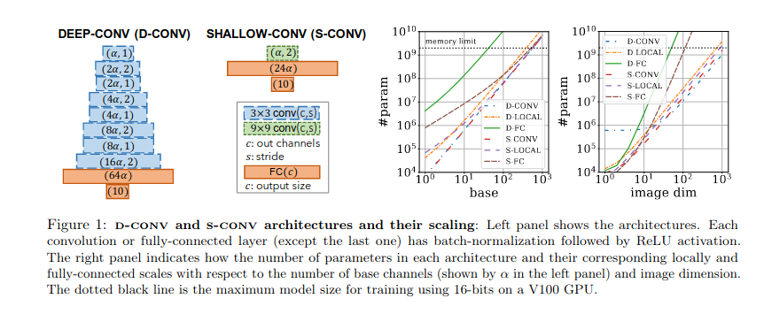
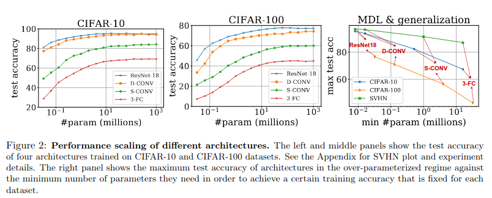

# Paper analysis 
This file is dedicated to analysing and identifying key point of the original paper `Towards Learning Convolutions from Scratch`

## Introduction
The objective of this paper is to move from explicitely creating convolutional network to more general purpose network, thus avoiding expert bias.

The objective is to find convolution like layers in fully-connected networks.

The challenge are as follows: reducing inductive bias require more data, more computation and larger models

### Paper achievement
1 - Introducing S-conv and D-conv all convolutional networks, to study convolutions, comparing localy connected and fully-connected allows for observations on the role of depth, local connectivity and weight sharing :
    - Local connectivity have the greatest impact on performance
    - depth bring effiency in memory and computation
    - depth benefit greatly reduce without weight sharing 
2 - studying Minimum Description Length (MDL) :
    - MDL can be bound by the number of parameters, fewer parameters => better results in over-parametrized regime 
    - ???
3 - training $\Beta-LASSO$ a variant of LASSO :
    - state of the art result on CIFAR-10, CIFAR-100 and SVHN
    - fewer parameters than other locally connected 
    - ResNet18 with different kernel size 

## Disentangling Depth, Weight sharing and Local connectivity

Given a convolutional network, we define the following :
- localy connected network : same connnectivity without weight sharing 
- fully connected network : local connectivity adding connections between all nodes in adjacent layers 

- The bias of convolution is hard to study due to the existence of pooling and residual connections, they are impossible to remove.
- Other possibility is all-convolutional network but they are too big to be studied.
- To resolve this you could scale down the number of parameters wich unfortunately degrades the performance significantly.

### Introducing D-conv and S-conv
<b>TODO : The following image need to be reproduced</b>

This graph shows the number of parameters as a function of the base channels and the input image size 

